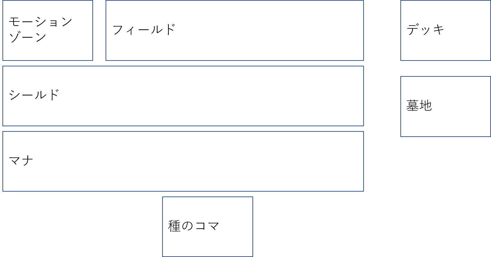

# ノゲTCGのルール

## ゲームを始める前に

デッキ(60枚)と種のコマ(1枚)を用意します。

デッキを良くカットし、種のコマは裏向きでセットします。

デッキから3枚、種のコマの下に裏向きにセットします。

デッキから5枚、シールドとしてセットします。

じゃんけん等で先攻後攻を決め(勝った方が選択)、デッキから5枚を手札に加え、「盟約に誓って」の掛け声のもと、種のコマを表向きにしてゲームスタートです。

## フェイズについて

### リフレッシュフェイズ

ターンプレイヤーの場のカードと、お互いのマナをアンタップします。

### ドローフェイズ

ターンプレイヤーはデッキから1枚カードを引きます。(強制)

### マナフェイズ

ターンプレイヤーは手札から1枚、マナへ置くことが出来ます。

その場合、デッキからカードを1枚引きます。(強制)

### メインフェイズ

ターンプレイヤーは、手札のカードをプレイしたり、場、墓地等のカードの効果を発動することが出来ます。

優先権(※後述)を得ることで、非ターンプレイヤーも一部のカードや効果を発動することが出来ます。

### バトルフェイズ

ターンプレイヤーは、自分のフィールドのキャラクター1体をタップすることで、相手の種のコマ(シールド)に対しアタック宣言を行うことが出来ます。

対象プレイヤーは、自分のキャラクター1体をタップすることでブロックを宣言することが出来ます。

ブロックが行われた場合、BPを比べ低い方のキャラクターが破壊されます。(同じ場合は両方が破壊される)

ブロックが行われなかった場合、対象プレイヤーにシールドがあれば、アタックしたプレイヤーがシールドを選んでブレイクします。

対象プレイヤーにシールドがない場合、コマを奪取することができます。

また、優先権(※後述)を得ることで、お互いのプレイヤーは一部のカードや効果を発動することが出来ます。

シールドがブレイクされたとき、それがSトリガーを持つカードであれば、マナコストを支払うことなくプレイすることが出来ます。

### エンドフェイズ

ターンの終了を宣言します。

## 勝利(敗北)条件について

### 種族全権の剥奪

種のコマが奪取された場合、そのコマを所有していたプレイヤーはゲームに敗北します。

コマを対象としたアタックのダメージ計算が行われる場合、コマはアタックしたプレイヤーへ委譲されます。

また、コマの移譲はカードの破壊としても扱われます。

## 盤面と配置について

### 場

#### フィールド

キャラクターを置くゾーンです。

枚数制限はありません。

#### モーションゾーン

モーションカードを置くゾーンです。

基本的に枚数制限はありませんが、フィールドカードのみ1プレイヤーにつき1枚までしか同時に置くことが出来ません。

チェーン中のモーションカードはモーションゾーンに置かれ、(原則)効果処理が終了次第墓地へ送られます。

### マナ

マナ扱いのカードを置くゾーンです。

慣例的に、逆向きで置くことを推奨します。

### デッキ

デッキを置くゾーンです。

### 墓地

破壊される等の理由で墓地へ送られたカードを置くゾーンです。

### 種のコマ

種のコマを置くゾーンです。

種のコマは同時に1枚までしか存在することが出来ません。

## カードの種類について

### キャラクター

#### カード名

#### 種族

キャラクター毎に16種族のどれかが記されています。

序列は原作に従います。

#### コスト

このキャラクターをプレイすることで場に出すときに必要なコストです。

#### 効果

このキャラクターのコストです。

#### BP

このキャラクターの攻撃力です。

主にアタック/ブロックで利用されます。

#### 進化

記載された条件を満たすカードが指定されたゾーンにあれば、コストを支払いそのカードを下に重ねることで場に出すことが出来ます。

進化キャラクターは、(原則)単体でフィールドへ残ることはできません。

#### 反転

記された条件を満たすことで、カードの上下を回転させることが出来ます。

(原則)上側のカードとしてしか場に出すことができません。

フィールドに存在する場合、下側になっているカードの記述は無視されます。

### モーションカード

#### 魔法

#### 道具

#### イベント

##### 通常

ターンプレイヤーのメインフェイズにのみ、コストを支払うことでプレイできます。

効果終了後は墓地へ置かれます。

##### 永続

ターンプレイヤーのメインフェイズにのみ、コストを支払うことでプレイできます。

発動後も場に残り続け、起動効果、誘発効果はキャラクターと同等に発動することが出来ます。

永続効果は、このカードが場にある限り適用されます。

##### 装備

永続なモーションカードと同等に扱われます。

プレイする際には必ず(原則)自分のキャラクター1体を指定し、そのキャラクターのBPを変更したりなど効果を適用し続けます。

##### 速攻

ターンプレイヤーのメインフェイズの他、優先権があればいつでもコストを支払うことでプレイできます。

効果終了後は墓地へ置かれます。

#### フィールド

永続なモーションカードと同等に扱われます。

但し、同一プレイヤーにつき1枚までしかモーションゾーンに存在できません。

#### ゲーム

永続なモーションカードと同等に扱われます。

効果と敗北条件が記されており、永続的に作用します。

敗北条件を満たしたプレイヤーは、(チェーンに割り込んで)自身のシールドとこのカードを墓地へ置きます。(強制)

### 種のコマ

種のコマは、ゲーム中3回まで条件を満たすことで強力な効果を発動できるカードです。

また、特定の種のコマが場にあるときのみ追加効果が発動するカードが存在します。

種のコマ(の下)には、ゲーム開始前にデッキからカードが3枚裏向きでセットされます。

ターンプレイヤーは、コマに記載された条件を満たしている場合、コマにセットされたカード1枚を手札に加えることで効果が発動できます。

コマの効果はチェーンを組みません。(コマの発動に対し、効果・カードを発動することはできません。逆も然りです)

# 効果の種類

## 起動効果

ターンプレイヤーがメインフェイズに発動する効果です。

場に存在するカードを指定して宣言することで効果が発動できます。

## 誘発効果

優先権を持つプレイヤーが発動条件を満たした場合に発動することが出来る効果です。

## 永続効果

効果の発動を行うことなく、永続的に作用し続ける効果です。

# チェーン

カード又は効果が発動宣言されている場合、優先権を持つプレイヤーが効果を発動することを差します。

ここでいう効果の発動とは、永続でないモーションカードのプレイを含みます。

チェーンが複数積まれた場合、後に宣言された効果から解決することになります。

スペルスピードの概念が存在しないため、誘発効果や速攻のモーションカードに対し起動効果や通常のモーションカードを発動することが可能です。

# 優先権

これを持つプレイヤーは効果の発動が可能です。

優先権が発生するのは以下のような場合です。

+ メインフェイズの開始時 (ターンプレイヤーへ与えられる)
+ ブロック宣言の終了時 (ブロック側のプレイヤーに与えられる)
+ バトル中におけるチェーンの解決後 (ブロック側のプレイヤーに与えられる)

優先権が消滅するのは、以下のような場合です。

+ お互いのプレイヤーが優先権を放棄した場合
+ エンドフェイズの終了時

優先権が移るタイミングは以下の通りです。

+ カードをプレイした場合
+ 効果を発動した場合
+ 優先権を放棄した場合 (優先権を持つプレイヤーが、効果を発動しないことを宣言した時)

また、優先権を放棄した場合についてですが、以下のような場合が考えられます。

+ メイン、バトル、エンドフェイズの終了宣言時
+ ブロック宣言の終了後、ブロック側のプレイヤーが効果を発動しない場合
+ バトル中チェーン解決後、ブロック側のプレイヤーが効果を発動しない場合
+ 相手が優先権を放棄したにもかかわらず、自身が効果を発動しない場合

